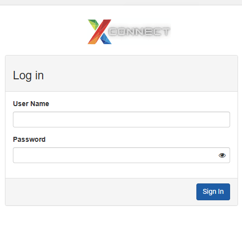

# How to Access Corrupted VM Data

If a virtual machine (VM) becomes corrupted, its data can still be accessed by creating a snapshot of the VM and then generating a volume from that snapshot. The created volume can be attached to another working VM, allowing you to retrieve files and important information from the corrupted VM.

---

## Step 1: Log in to the Portal

Log in to the cloud portal using the following URL:

[Login to Xloud Portal](https://portal-del.xloud.tech/auth/login/?next=/)

 

---

## Step 2: Navigate to Instances

1. Go to the **Project** tab.
2. Open the **Compute** section.
3. Click on **Instances**.

<Note>Make sure your account has the Project → Compute permission to view instances.</Note>

---

## Step 3: Create a Snapshot of the Corrupted VM

1. Locate the corrupted VM from the Instances list.
2. Click on the **Create Snapshot** button associated with the VM.
3. Enter a **Snapshot Name**.
4. Click **Create Snapshot** to start the snapshot creation process.

This snapshot captures the current state of the corrupted VM.

<Warning>Ensure the VM is quiesced or shut down before taking snapshots for consistent filesystem state.</Warning>

---

## Step 4: Create a Volume from the Snapshot

1. Go to **Images** under the **Compute** section of the Project tab.

2. Locate the snapshot created for the corrupted VM.

3. Click the **arrow icon** next to the snapshot to view additional options.

4. Select **Create Volume**.
5. Provide the following details:
   - **Volume Name:** Assign a name to the volume.
   - **Description:** (Optional) Add a description, such as *my volume description*.
6. Click **Create Volume** to finalize the process.

The volume now contains a copy of the data from the corrupted VM.

---

## Step 5: Attach the Volume to Another VM

To access the data, attach the newly created volume to a working VM.

<Tip>Mount the attached volume read-only on the rescue VM to avoid altering original data.</Tip>

For detailed instructions, refer to **How to Attach Volume to VM and Move Volume to Another VM?**
