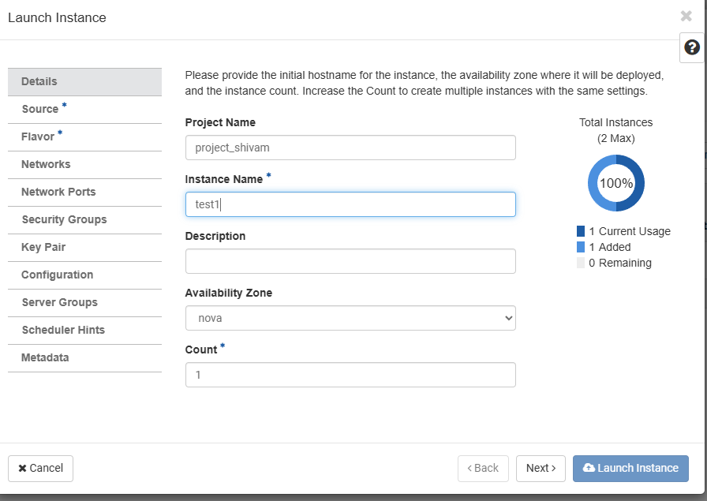
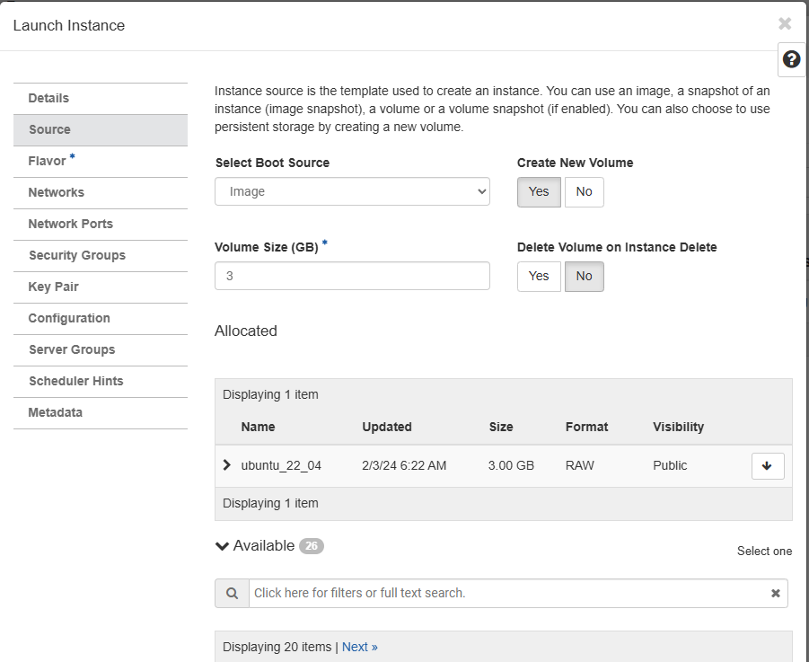
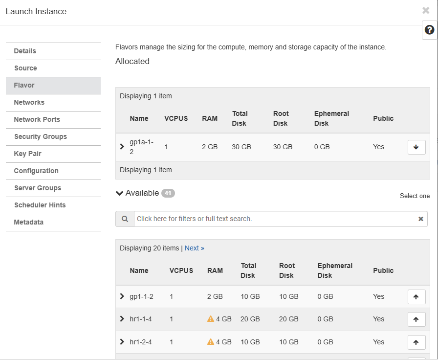
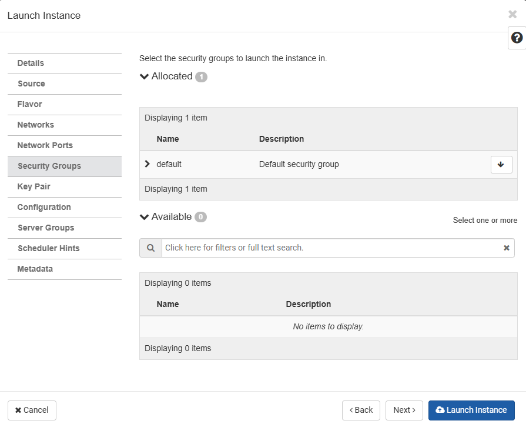
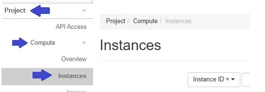

# How to Create a Virtual Machine (VM / Instance)

A **Virtual Machine (VM)**, also known as an **Instance**, is a virtual computer running on cloud infrastructure. It allows users to deploy and run applications without managing physical hardware.

## Key Concepts

- **Subnet**: A logical division of an IP network range used for network segmentation and efficient IP address management.
- **ILL (Internet Leased Line)**: A dedicated, high-speed connection that provides connectivity to external networks or the Internet.

>  To create a subnet, refer to **How to Create Subnet?**

---

## Step 1: Login to the Portal

Open the following URL in your browser and log in using your credentials:

https://portal-del.xloud.tech/auth/login/?next=/

---

## Step 2: Navigate to Instances

Follow the steps below to reach the instance creation page:

1. Go to the **Project** tab.
2. Open the **Compute** section.
3. Click on **Instances**.

4. Click **Launch Instance**.

---

## Step 3: Configure Instance Details

### Details Tab

Provide the basic configuration for the virtual machine:

- **Instance Name**  
  Assign a meaningful name to the VM.

- **Description**  
  (Optional) Add a short description for the VM.

- **Count**  
  - Specify the number of instances to create.
  - Ensure you have sufficient quota before increasing the count.

---

## Step 4: Select Source (Operating System)

### Source Tab

Configure the operating system and storage options:

- **Create New Volume**
  - **Yes (Recommended)**  
    Creates a new volume and allows OS disk expansion after deployment.
  - **No**  
    Uses fixed-size storage and does not support disk expansion.

- **Volume Size (GiB)**
  - Define the size of the OS disk.
  - Enables dynamic expansion later if required.

- **Delete Volume on Instance Delete**
  - **Yes** → Deletes the volume when the VM is deleted.
  - **No** → Retains the volume after VM deletion.

- **Image**
  - Select the required **Operating System / Image** from the list.

---

## Step 5: Choose Flavor (Compute Resources)

### Flavor Tab

A **Flavor** defines the hardware resources allocated to the VM:

- Number of vCPUs
- Amount of RAM
- Overall performance capacity

Select a flavor based on the application or workload requirements.

---

## Step 6: Configure Networks

### Network Tab

Switch to the **Networks** tab.

Select both **ILL** and **Subnet**.  
Choosing both options helps reduce IP-related costs that are typically associated with creating and managing a router.

Ensure the required networks are selected before proceeding to the next step.

---

## Step 7: Configure Security Groups

### Security Group

Switch to the **Security Groups** tab.

Security groups are collections of network access rules that control the inbound and outbound traffic allowed to reach an instance.

- By default, the **default** security group is selected.
- To use a custom security group, click the **arrow-up** icon to add it to the instance.

> **Note:** To create a new security group, refer to **How to Create Security Groups?**

---

## Step 8: Select a Key Pair

### Key Pair

Switch to the **Key Pair** tab.

A **key pair** consists of:
- A **public key**, which is used to encrypt data
- A **private key**, which is used to decrypt data

Key pairs are associated with individual users and are not shared at the project level.

Select the required key pair by clicking the **arrow-up** icon.

---

## Step 9: Launch the Instance

To complete the VM creation process, click **Launch Instance**.

The virtual machine will be created and made available for use. Once launched, it can be accessed and managed through the dashboard.

To locate the created VM:
1. Go to the **Project** tab.
2. Open the **Compute** section.
3. Click on **Instances**.

The newly created VM will be listed under the Instances page.
