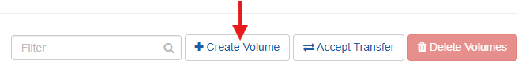
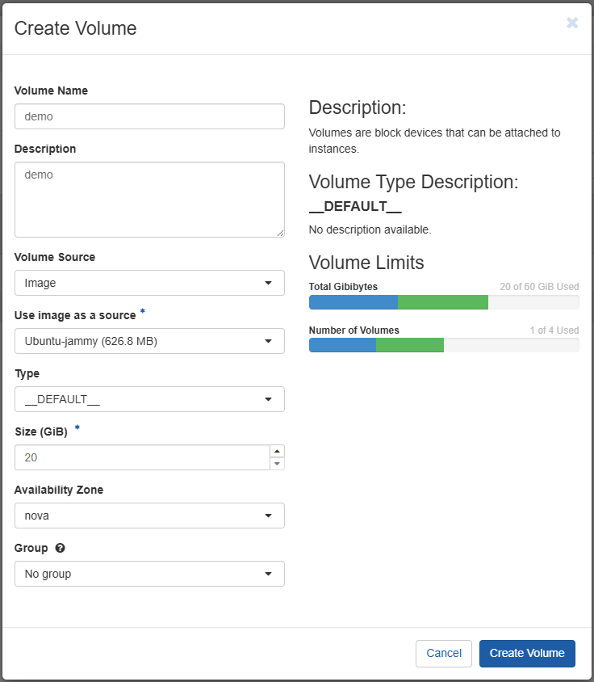
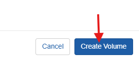
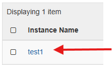
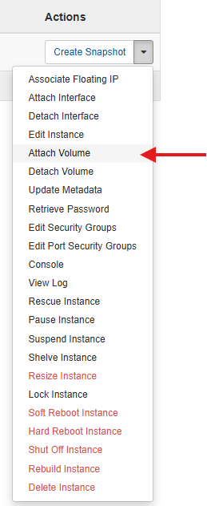
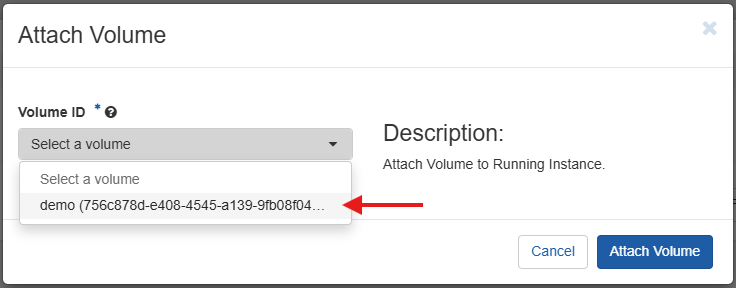

## What is a Volume?

A **Volume** is essentially a block of storage presented to a virtual machine that behaves like a virtual disk. You can read and write data to it just like you would on a physical HDD or SSD.

**Key characteristics:**
- **Persistent** - meaning the data stays even if the VM is stopped or restarted (unless you delete the volume)
- **Attachable** - can be attached to different VMs as needed
- **Expandable** - can be resized to accommodate growing storage needs
- **Independent** - exists separately from VM instances

---

## Step 1: Log in to the Portal

Log in to the <a href="https://portal-del.xloud.tech/auth/login/?next=/" target="_blank">xconnect portal</a>  using your credentials.

---

## Step 2: Navigate to Volumes

Follow the navigation path:

`Project → Volumes → Volumes`

<Steps>
  <Step>Go to the <b>Project</b> tab</Step>
  <Step>Click on <b>Volumes</b> tab</Step>
  <Step>In the dropdown menu, click on <b>Volumes</b></Step>
</Steps>

---

## Step 3: Create Volume

<Steps>
  <Step>Click on <b>Create Volume</b></Step>
</Steps>

---

## Step 4: Configure Volume Details

Enter the following details:

### **Basic Information**

<Steps>
  <Step><b>Volume Name</b>: Enter a descriptive name for the volume</Step>
  <Step><b>Description</b>: Optionally, provide a brief description (e.g., "Database storage volume")</Step>
</Steps>

### **Volume Source Options**

Choose one of the following **Volume Source** options:

<b>📋 Volume Source Types - Click to Expand</b>

#### **No source, empty volume**
- **Creates a volume from scratch** without any pre-existing data
- **Provides a blank slate** for custom configuration
- **Use case**: When you need fresh, unformatted storage
- **Next step**: Attach to VM and initialize with file system

#### **Image**
- **Use Image as a source** - Select an existing VM snapshot
- **Point-in-time copy** of a VM's disk contents
- **Use case**: Create volume with same data as snapshot
- **Benefit**: Quick deployment with pre-configured data

#### **Snapshot**
- **Choose a specific snapshot** from available list
- **Captured state** of VM's disk at particular moment
- **Use case**: Create volume from specific point in time
- **Benefit**: Access historical data or configurations

#### **Volume**
- **Choose existing volume** as source for new volume
- **Creates copy or clone** of existing volume
- **Use case**: Duplicate volumes with same data
- **Benefit**: Multiple volumes with identical configurations

### **Advanced Configuration**

<Steps>
  <Step><b>Type</b>: Leave this field on <b>__DEFAULT__</b></Step>
  <Step><b>Size (GiB)</b>: Specify the volume size in gibibytes</Step>
  <Step><b>Availability Zone</b>: By default, set to <b>nova</b></Step>
  <Step><b>Group</b>: Choose <b>No group</b> if the volume belongs to no group</Step>
</Steps>

<Info>
Volume size should be planned according to your storage requirements. You can expand volumes later, but shrinking is not typically supported.
</Info>

---

## Step 5: Finalize Volume Creation

<Steps>
  <Step>Review all configuration details</Step>
  <Step>Click <b>Create Volume</b> to finalize</Step>
</Steps>

---

## Step 6: Verify Volume Creation

<Steps>
  <Step>Check the Volumes list for your new volume</Step>
  <Step>Verify the status shows as <b>Available</b></Step>
  <Step>Confirm size and configuration details</Step>
</Steps>

<Tip>
Once the volume status shows "Available", it's ready to be attached to any instance.
</Tip>

---

## Attaching Volume to Instance

Once the volume has been created, you can attach it to any instance:

<Steps>
  <Step>Navigate to <b>Project → Compute → Instances</b>
  </Step>
  <Step>Select the target instance
  </Step>
  <Step>Click <b>Attach Volume</b> from the actions menu
  </Step>
  <Step>Select your newly created volume
   </Step>
  <Step>Confirm the attachment
  </Step>
</Steps>

<Note>
After attaching, you may need to format and mount the volume within the VM's operating system before use.
</Note>

---

## Volume Types and Use Cases

### **Common Volume Uses:**
- **Database storage** - Persistent data that survives VM restarts
- **Application data** - User files, logs, and application state
- **Backup storage** - Secondary storage for backup purposes
- **Shared storage** - Data accessible across multiple VMs

### **Volume Size Guidelines:**
- **Small volumes** (10-50 GiB): Configuration files, small databases
- **Medium volumes** (50-500 GiB): Application data, medium databases
- **Large volumes** (500+ GiB): Big data, large databases, media storage

<Warning>
Plan volume sizes carefully. While expansion is possible, it may require downtime and file system operations.
</Warning>

---

## Volume Successfully Created

Your persistent storage volume is now ready for use and can be attached to virtual machines as needed for reliable, persistent data storage.