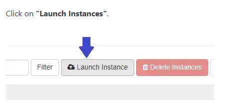

# How to Create a Virtual Machine (VM / Instance)

A **Virtual Machine (VM)**, also known as an **Instance**, is a virtual computer running on cloud infrastructure. It allows users to deploy and run applications without managing physical hardware.

## Key Concepts

- **Subnet**: A logical division of an IP network range used for network segmentation and efficient IP address management.
- **ILL (Internet Leased Line)**: A dedicated, high-speed connection that provides connectivity to external networks or the Internet.

:::note
To create a subnet, refer to **How to Create Subnet?**
:::

## Step 1: Login to the Portal

Open the following URL in your browser and log in using your credentials:

[Login to Xloud Portal](https://portal-del.xloud.tech/auth/login/?next=/)

## Step 2: Navigate to Instances

1. Go to the **Project** tab.
2. Open the **Compute** section.
3. Click on **Instances**.
4. Click **Launch Instance**.

## Step 3: Configure Instance Details

### Details Tab

- **Instance Name** – Assign a meaningful name.
- **Description** – Optional short description.
- **Count**
  - Number of instances to create
  - Ensure sufficient quota

:::tip
Check your project quota limits before creating multiple instances.
:::

## Step 4: Select Source (Operating System)

### Source Tab

- **Create New Volume**
  - **Yes (Recommended)** – Allows OS disk expansion
  - **No** – Fixed-size storage
- **Volume Size (GiB)** – Define OS disk size
- **Delete Volume on Instance Delete**
  - **Yes** – Deletes volume
  - **No** – Retains volume

:::warning
Select **No** if you want to preserve data after instance deletion.
:::

- **Image** – Select the required OS image

## Step 5: Choose Flavor (Compute Resources)

A **Flavor** defines VM resources:
- vCPUs
- RAM
- Performance capacity

## Step 6: Configure Networks

Select both **ILL** and **Subnet** to optimize networking costs.

:::tip
Selecting both ILL and Subnet can reduce IP-related costs.
:::

## Step 7: Configure Security Groups

- Default security group is selected
- Use arrow-up icon to add a custom group

:::note
Refer to **How to Create Security Groups?**
:::

## Step 8: Select a Key Pair

Key pairs consist of a public and private key.

:::warning
Never share your private key. Store it securely.
:::

## Step 9: Launch the Instance

Click **Launch Instance** to create the VM.

To locate the VM:
1. Project → Compute → Instances

